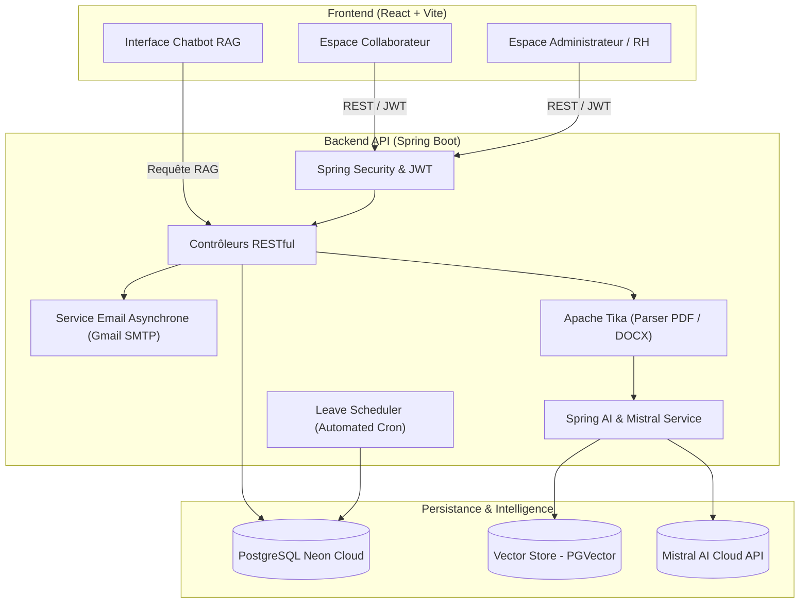

# 🏢 IntraSpace — Plateforme Intelligente de Gestion des Congés & Portail RH

<p align="center">
  
  
  
  
  
  
</p>

---

## 📌 À Propos du Projet

**IntraSpace** est une application web full-stack moderne conçue pour automatiser et simplifier la gestion des ressources humaines, le suivi des congés et des absences en entreprise.

Elle intègre un **assistant RH intelligent basé sur l'IA Générative (RAG)** propulsé par **Spring AI**, **Mistral AI**, **PGVector** et **Apache Tika**, permettant aux collaborateurs d'interroger instantanément les politiques internes, conventions collectives et règlements de l'entreprise.

---

## ✨ Fonctionnalités Clés

### 👥 Espace Employé
- **Tableau de bord dynamique** : Vue en temps réel des soldes de congés (Payés, Maladie, Maternité, Sans solde) et des prochaines échéances.
- **Demande de congé en ligne** : Formulaire ergonomique avec sélection de dates, calcul automatique des jours ouvrés et suivi des statuts (`EN_ATTENTE`, `APPROUVE`, `REFUSE`).
- **Fiches de paie & Documents** : Consultation et téléchargement des bulletins de salaire au format PDF.
- **Chatbot RH Contextuel (RAG)** : Posez vos questions en langage naturel sur la politique de l'entreprise et obtenez des réponses sourcées en quelques secondes.
- **Gestion du profil** : Consultation des données personnelles et modification sécurisée du mot de passe.

### 🛡️ Espace Administrateur / RH
- **Gestion des collaborateurs** : Création, modification et désactivation des profils avec envoi asynchrone automatisé des identifiants par email.
- **Validation des demandes** : Interface intuitive d'approbation ou de rejet des congés avec notification immédiate par email aux employés.
- **Calendrier des absences** : Visualisation globale des disponibilités pour anticiper les effectifs par équipe.
- **Base documentaire & Ingestion IA** : Téléversement de documents RH (PDF, DOCX), indexation automatique avec calcul d'embeddings vectoriels pour le Chatbot.
- **Planificateur de soldes** : Recalcul automatique périodique des droits à congés via des tâches planifiées Spring.

---

## 🏗️ Architecture du Système



---

## 🛠️ Stack Technologique

| Composant | Technologie | Description |
| :--- | :--- | :--- |
| **Backend Framework** | `Spring Boot 3.3+` | Framework Java d'entreprise pour des APIs robustes |
| **Langage Backend** | `Java 17 / 21` | Orienté objet moderne et performant |
| **Sécurité** | `Spring Security 6` + `JJWT 0.12` | Authentification sans état via tokens JWT |
| **Intelligence Artificielle** | `Spring AI 2.0` + `Mistral AI` | RAG avec embeddings vectoriels et complétion |
| **Extraction de Documents** | `Apache Tika 2.9` | Analyse et extraction de texte depuis PDF et Word |
| **Base de Données** | `PostgreSQL (Neon Tech Cloud)` | SGBD relationnel cloud avec extension vectorielle |
| **Frontend Framework** | `React 18` + `Vite` | SPA ultra-rapide avec Hot Module Replacement |
| **Styling & Design** | `Bootstrap 5` + `SCSS Modulaire` | Design system corporate avec tokens et typographie soignée |
| **Icônes & UI** | `Lucide React` / `Bootstrap Icons` | Composants graphiques vectoriels modernes |

---

## 📁 Structure du Projet

```text
gestionConges/
├── back/                                 # API Backend Spring Boot
│   ├── src/main/java/com/backend/intraspace/
│   │   ├── config/                       # Sécurité, Async, Scheduler, Seeder
│   │   ├── controller/                   # Contrôleurs REST (Auth, Conge, Employe, Chatbot)
│   │   ├── dto/                          # Data Transfer Objects
│   │   ├── entity/                       # Entités JPA (Employe, DemandeConge, Document)
│   │   ├── repository/                   # Spring Data JPA Repositories
│   │   ├── security/                     # Filtres JWT & UserDetailsService
│   │   └── services/                     # Logique métier et implémentations RAG
│   ├── src/main/resources/
│   │   ├── application.properties        # Configuration générale de l'application
│   │   └── db/changelog/                 # Migrations Liquibase
│   ├── run-backend.bat.example           # Script modèle de démarrage local
│   └── pom.xml                           # Dépendances Maven
│
├── front/                                # Application Frontend React
│   ├── src/
│   │   ├── assets/scss/                  # Design System SCSS (thème corporate, variables)
│   │   ├── components/layout/            # Sidebar, Topbar, Layout employé et admin
│   │   ├── context/                      # Contextes d'authentification et notifications
│   │   ├── pages/
│   │   │   ├── admin/                    # Dashboard RH, validation congés, gestion équipe
│   │   │   └── employe/                  # Dashboard perso, demandes, fiches de paie, chatbot
│   │   └── services/                     # Client Axios et appels API
│   ├── package.json                      # Dépendances NPM
│   └── vite.config.js                    # Configuration Vite
│
├── documents_test/                       # Documents RH d'exemple pour tester le RAG
└── README.md                             # Documentation du projet
```

---

## 🚀 Démarrage Rapide

### Prérequis
- [Java 17](https://www.oracle.com/java/technologies/javase/jdk17-archive-downloads.html) ou supérieur
- [Node.js 18+](https://nodejs.org/) & `npm`
- Une base de données PostgreSQL (locale ou [Neon.tech](https://neon.tech))
- Une clé API [Mistral AI](https://console.mistral.ai/) *(optionnelle si désactivation du chatbot)*

---

### 1. Configuration du Backend

1. Rendez-vous dans le répertoire `back/` :
   ```bash
   cd back
   ```

2. Créez votre fichier de configuration d'environnement `.env` (ou configurez vos variables système) :
   ```properties
   DB_URL=jdbc:postgresql://<VOTRE_HOST_POSTGRESQL>:5432/neondb?sslmode=require
   DB_USERNAME=neondb_owner
   DB_PASSWORD=votre_mot_de_passe
   MAIL_USERNAME=votre_adresse_gmail@gmail.com
   MAIL_PASSWORD=votre_mot_de_passe_application_google
   MISTRAL_API_KEY=votre_cle_mistral_ai
   ```

3. Lancez le serveur Spring Boot avec Maven Wrapper :
   ```bash
   # Sur Windows :
   .\mvnw.cmd spring-boot:run

   # Sur Linux / macOS :
   ./mvnw spring-boot:run
   ```
   > Le serveur démarre sur **`http://localhost:8080`**.

---

### 2. Configuration du Frontend

1. Ouvrez un nouveau terminal et naviguez dans le dossier `front/` :
   ```bash
   cd front
   ```

2. Installez les dépendances :
   ```bash
   npm install
   ```

3. Démarrez le serveur de développement Vite :
   ```bash
   npm run dev
   ```
   > L'application est accessible sur **`http://localhost:5173`**.

---

## 🔑 Identifiants de Test (Données Initiales)

À l'initialisation de l'application, des comptes de démonstration sont injectés :

| Rôle | Email | Mot de passe | Accès |
| :--- | :--- | :--- | :--- |
| **Administrateur / RH** | `admin@intraspace.com` | `admin123` | Gestion globale, approbation des congés, upload documents |
| **Employé Démo** | `employe@intraspace.com` | `employe123` | Demandes de congés, fiches de paie, chatbot RH |

---

## 📡 Aperçu des Endpoints Principaux (API REST)

| Méthode | Endpoint | Description | Accès requis |
| :--- | :--- | :--- | :--- |
| `POST` | `/api/v1/auth/login` | Authentification & délivrance du token JWT | Public |
| `GET` | `/api/v1/employes` | Liste de tous les collaborateurs | `ADMIN` |
| `POST` | `/api/v1/employes` | Création d'un nouvel employé + envoi d'email | `ADMIN` |
| `GET` | `/api/v1/conges` | Liste des demandes de congés | `ADMIN` / `EMPLOYE` |
| `POST` | `/api/v1/conges` | Soumission d'une nouvelle demande de congé | `EMPLOYE` |
| `PUT` | `/api/v1/conges/{id}/status` | Approbation ou refus d'un congé | `ADMIN` |
| `POST` | `/api/v1/chatbot/ask` | Requête en langage naturel à l'IA RAG | Authentifié |
| `POST` | `/api/v1/documents/upload` | Téléversement et indexation de document RH | `ADMIN` |
| `GET` | `/api/v1/payslips/my-payslips` | Consultation des fiches de paie | `EMPLOYE` |

---

## 🔒 Sécurité & Bonnes Pratiques

- **Protection des secrets** : Les clés d'API et identifiants de base de données sont externalisés via variables d'environnement et ignorés par Git.
- **Authentification sans état** : Vérification des autorisations par filtre de servlet JWT (`OncePerRequestFilter`).
- **Communication asynchrone** : Les emails de bienvenue et de notification sont envoyés via un `ThreadPoolTaskExecutor` dédié pour éviter tout blocage des requêtes HTTP.
- **Journalisation normalisée** : Remplacement des `System.out.println` par la façade **SLF4J** pour une traçabilité claire en production.

---

## 👨‍💻 Auteur & Contribution

Développé par **[Mohamed Ali](https://github.com/MohamedAliCH)** dans le cadre du projet de stage **IntraSpace**.

Pour toute suggestion, anomalie ou question, n'hésitez pas à ouvrir une [Issue GitHub](https://github.com/MohamedAliCH/Gestion-Conges/issues).
